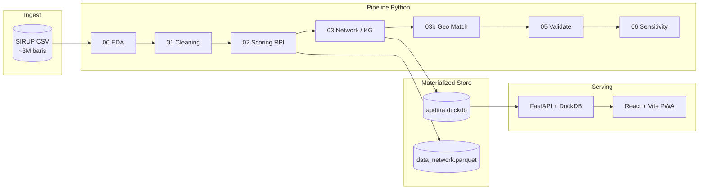

<p align="center">
  
</p>

<h1 align="center">Auditra</h1>

<p align="center">
  <strong>Sistem Prioritas Audit Pengadaan Publik berbasis Knowledge Graph &amp; Analisis Jaringan</strong><br/>
  Mengolah ~3 juta paket SIRUP LKPP untuk membantu auditor fokus pada yang paling mendesak — bukan menebak.
</p>

<p align="center">
  <a href="https://github.com/danisharizka/auditra">GitHub</a> ·
  <a href="https://sirup.lkpp.go.id/">SIRUP LKPP</a> ·
  Tim <code>SD2026020000253</code> · TA 2026
</p>

<p align="center">
  
  
  
  
</p>

---

## Mengapa Auditra?

Indonesia mencatat **jutaan rencana paket pengadaan** di SIRUP setiap tahun. Auditor dan pemeriksa tidak mungkin menelusuri semuanya satu per satu. Auditra menjawab pertanyaan praktis:

> **Paket mana yang paling layak masuk antrean audit berikutnya — dan mengapa?**

Bukan dengan skor hitam-putih, melainkan **Risk Priority Index (RPI)**: alat **prioritas**, bukan vonis. Setiap angka dapat ditelusuri ke **7 sinyal risiko** yang transparan, diperkaya **Knowledge Graph** lembaga–satker, dan divisualisasikan di dashboard interaktif peta seluruh Indonesia.

---

## Fitur Dashboard

| Modul | Apa yang bisa dilakukan |
|-------|-------------------------|
| **KPI & Stat Cards** | Total paket, pagu berisiko, distribusi tier risiko, cakupan geografi |
| **Peta Choropleth** | Prioritas audit per kab/kota — seluruh Indonesia; 4 mode pemilik (K/L · Pemprov · Pemkot · Lainnya); toggle RPI / Pagu Berisiko |
| **Sidebar Lembaga** | Top lembaga prioritas audit; klik untuk filter; tier Ekstrem (KRITIS + anomali) |
| **7 Sinyal RPI** | Radar chart profil risiko; bar chart per metode; scatter pagu vs RPI |
| **Knowledge Graph** | Subgraf lembaga–satker mengikuti filter aktif; kesimpulan otomatis |
| **Daftar Paket** | Tabel prioritas dengan pagination (50/halaman) — akses penuh ke dataset via API |
| **Filter Global** | Provinsi · Lembaga · Metode · Ambang RPI minimum |
| **Tema & PWA** | Dark / light mode; installable di mobile & desktop; responsif PC–tablet–ponsel |

**Integritas data:** statistik agregat, ranking, peta, dan KG dihitung dari **seluruh baris** yang cocok filter. Satu-satunya sampling eksplisit: scatter chart (max 3.000 titik acak untuk performa render).

Verifikasi runtime:

```http
GET http://127.0.0.1:8000/api/meta
```

---

## 7 Sinyal RPI (Ringkas)

| # | Sinyal | Bobot | Intuisi |
|---|--------|-------|---------|
| S1 | Metode pemilihan | 20% | Penunjukan langsung / dikecualikan = risiko tata kelola lebih tinggi |
| S2 | Anomali pagu | 20% | Z-score pagu dalam grup `(jenis, metode)` |
| S3 | Fragmentasi / split contract | 15% | TF-IDF + cosine similarity uraian dalam satker (batas PL Rp 200 jt) |
| S4 | Konsentrasi metode berisiko | 15% | Proporsi penunjukan/dikecualikan per satker |
| S5 | Anomali UMKM | 10% | Flag UMKM vs pagu besar |
| S6 | Sentralitas jaringan | 10% | Betweenness / degree di Knowledge Graph |
| S7 | Komunitas risiko | 10% | Modularity community detection |

Formula lengkap, dasar regulasi (PP 12/2019, Perpres 16/2018), dan analisis sensitivitas bobot → [`docs/METODOLOGI.md`](docs/METODOLOGI.md).

---

## Statistik Utama (Verified)

| Metrik | Nilai |
|--------|-------|
| Baris dataset final | **3.002.992** |
| Kolom pipeline | **32** |
| Lembaga unik | 662 |
| Satker unik | 34.602 |
| Node Knowledge Graph | 35.320 |
| Edge KG | 207.427 |
| Paket tier KRITIS (RPI ≥ 70, post-KG) | 568 |
| Geo match rate | **99,2%** lokasi unik (46 edge case → `geo/unmatched_report.txt`) |

---

## Arsitektur



| Lapisan | Teknologi | Peran |
|---------|-----------|-------|
| Pipeline | Python, pandas, NetworkX, scikit-learn | EDA → cleaning → RPI → KG → geo |
| Store | DuckDB, Parquet | Query cepat tanpa memotong source |
| API | FastAPI 1.1 | Agregat, filter, pagination, bundle endpoint |
| Frontend | React 18, Vite 6, Tailwind, ECharts, Plotly, vis-network | Dashboard interaktif + PWA |

---

## Quick Start

### 1. Clone & siapkan data

```powershell
git clone https://github.com/danisharizka/auditra.git
cd auditra
```

Letakkan export SIRUP sebagai `data/year-2026_merged.csv` (lihat [`data/README.md`](data/README.md)). File ini **tidak** di-commit ke repo.

### 2. Jalankan pipeline analisis

```powershell
pip install -r requirements.txt
python run_pipeline.py
```

Opsi lanjutan:

```powershell
python run_pipeline.py --skip-eda      # lewati EDA
python run_pipeline.py --from 02       # mulai dari scoring
python run_pipeline.py --validate-only # QA gate saja
```

| Step | Script | Output utama |
|------|--------|--------------|
| 0 | `00_eda.py` | `output/reports/eda_*` |
| 1 | `01_cleaning.py` | `data/data_clean.csv` |
| 1b | `01b_patch_lembaga_provinsi.py` | patch data quality |
| 2 | `02_scoring.py` | `output/data_scored.csv` + 7 sinyal |
| 3 | `03_network_analysis.py` | KG + `output/data_network.csv` |
| 3b | `03b_geo_matching.py` | `geo/geo_lookup.csv` |
| 5 | `05_validate.py` | laporan QA |
| 6 | `06_sensitivity_analysis.py` | robustness bobot RPI |

*(Opsional, startup API lebih cepat)* `python scripts/export_parquet.py`

### 3. Jalankan dashboard web

**Terminal 1 — API:**

```powershell
pip install -r requirements-web.txt
uvicorn api.main:app --reload --host 127.0.0.1 --port 8000
```

Docs interaktif: http://127.0.0.1:8000/docs

**Terminal 2 — Frontend:**

```powershell
cd web
npm install
npm run dev
```

Buka **http://localhost:5173**

Build production frontend:

```powershell
cd web
npm run build
npm run preview
```

Panduan deploy split (Vercel + Railway/VPS): [`docs/DEPLOY.md`](docs/DEPLOY.md) · detail web: [`WEB.md`](WEB.md)

---

## API Endpoints (Utama)

| Endpoint | Fungsi |
|----------|--------|
| `GET /api/meta` | Verifikasi jumlah baris/kolom & integritas |
| `GET /api/filters/options` | Opsi provinsi, lembaga, metode |
| `GET /api/dashboard/bundle` | Satu request: overview, charts, KG, choropleth, ranking |
| `GET /api/geo/kabkota` | GeoJSON kab/kota untuk peta |
| `GET /api/packages?page=&…` | Pagination daftar paket (50/halaman) |
| `GET /api/kg` | Node & edge Knowledge Graph (filtered) |

**Performa:** bundle endpoint + cache in-memory DuckDB → ganti filter ~**0,3 detik** (vs puluhan detik scan CSV mentah). First startup setelah pipeline: build DuckDB ~15–60 detik; run berikutnya ~2 detik.

---

## Struktur Repositori

```
auditra/
├── run_pipeline.py                          # Orchestrator
├── 00_eda.py … 06_sensitivity_analysis.py   # Pipeline step scripts
├── api/                                     # FastAPI + DuckDB layer
│   ├── db.py                                # Query & aggregations
│   ├── filters.py                           # Dynamic WHERE builder
│   └── routers/                             # REST endpoints
├── web/                                     # React dashboard (PWA)
│   ├── public/                              # Logo, favicon, manifest, SW
│   └── src/components/                      # Map, charts, KG, tables
├── pipeline/                                # Shared pipeline utilities
├── geo/                                     # GeoJSON + lookup tables
├── output/                                  # Generated artifacts (gitignored)
├── scripts/                                 # export_parquet, gen_brand_assets
├── tests/                                   # Unit tests (validation)
└── docs/                                    # Metodologi, sains data, deploy
```

---

## Teknik Sains Data

- **EDA** — profil, missing value, IQR outlier, distribusi kategorikal
- **Preprocessing** — deduplikasi, normalisasi teks, patch artefak SIRUP
- **Statistik** — z-score anomali pagu, persentil, agregasi multi-dimensi
- **NLP** — TF-IDF + cosine similarity (deteksi fragmentasi paket)
- **Graph** — NetworkX: centrality, betweenness, community detection
- **Geo-spatial** — fuzzy matching lokasi SIRUP → kab/kota GeoJSON (514 fitur)
- **Serving** — DuckDB materialized cache; API agregat penuh, bukan sample

Lifecycle lengkap: [`docs/DATA_SCIENCE.md`](docs/DATA_SCIENCE.md)

---

## Dokumentasi Lengkap

| Dokumen | Isi |
|---------|-----|
| [`docs/METODOLOGI.md`](docs/METODOLOGI.md) | Algoritma step-by-step + dasar regulasi |
| [`docs/DATA_SCIENCE.md`](docs/DATA_SCIENCE.md) | Lifecycle sains data (EDA → deploy) |
| [`docs/SUMBER_DATA.md`](docs/SUMBER_DATA.md) | Provenance SIRUP & geo |
| [`docs/CHECKLIST_JURI_SEC.md`](docs/CHECKLIST_JURI_SEC.md) | Pemetaan kriteria SEC Satria Data |
| [`docs/DEPLOY.md`](docs/DEPLOY.md) | Deploy production (Vercel + backend) |
| [`WEB.md`](WEB.md) | Setup & performa dashboard web |

---

## Tim & Institusi

**Universitas Pembangunan Nasional Veteran Jawa Timur** · Tim `SD2026020000253`

Developed by **Dani Shofi Nur Izza**, **Danisha Rizka Hapsari**, **Galih Aji Pangestu**

---

## Lisensi & Sumber Data

| Aset | Lisensi / Catatan |
|------|-------------------|
| Kode sumber (repo ini) | Open source — lihat repositori |
| Data SIRUP | [LKPP — sirup.lkpp.go.id](https://sirup.lkpp.go.id/) — **tidak** di-commit (`.gitignore`) |
| GeoJSON Indonesia | [eppofahmi/geojson-indonesia](https://github.com/eppofahmi/geojson-indonesia) |

---

## Kutipan Data

> Lembaga Kebijakan Pengadaan Barang/Jasa Pemerintah. (2026). *Sistem Informasi Rencana Umum Pengadaan (SIRUP)*. Diakses dari https://sirup.lkpp.go.id/

---

<p align="center">
  <sub>Auditra © 2026 — Prioritas audit yang transparan, berbasis data, dan dapat diaudit.</sub>
</p>
