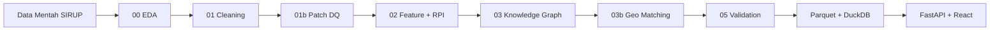

# Auditra — Data Science Lifecycle

Dokumen ini memetakan implementasi proyek Auditra terhadap **teori sains data** dari tingkat dasar hingga tingkat tinggi, dari data mentah hingga siap deploy.

---

## Ringkasan Maturitas

| Tahap DS | Status | Implementasi |
|----------|--------|--------------|
| **Problem framing** | ✅ | Audit prioritas pengadaan publik berbasis SIRUP + KG |
| **EDA** | ✅ | `00_eda.py` → `output/reports/eda_*` |
| **Data collection** | ✅ | `data/year-2026_merged.csv` (SIRUP) |
| **Preprocessing / cleaning** | ✅ | `01_cleaning.py`, `01b_patch_lembaga_provinsi.py` |
| **Feature engineering** | ✅ | 7 sinyal risiko di `02_scoring.py` |
| **Anomaly detection** | ✅ | Z-score pagu (S2), IQR outlier di EDA |
| **NLP / similarity** | ✅ | TF-IDF + cosine similarity (S3 fragmentasi) |
| **Graph analytics** | ✅ | Knowledge Graph, centrality, community detection |
| **Geo-spatial join** | ✅ | `03b_geo_matching.py` |
| **Model scoring** | ✅ | Rule-based weighted RPI (bukan ML supervised — by design) |
| **Validation / QA** | ✅ | `05_validate.py`, `pipeline/validate.py` |
| **Visualization** | ✅ | React dashboard + EDA Plotly HTML |
| **Serving / API** | ✅ | FastAPI + DuckDB materialized cache |
| **Deployment** | ⚠️ | Manual run; Docker opsional (lihat bawah) |
| **Monitoring / MLOps** | ❌ | Belum (tidak ada model ML yang perlu retrain) |
| **Supervised ML** | ➖ | Tidak dipakai — domain expert rules + KG |

**Kesimpulan:** Pipeline sudah mencakup **dasar → menengah → lanjut** untuk use case **rule-based risk scoring + knowledge graph**. Yang sebelumnya kurang (EDA formal, validasi terstruktur, orchestrator) sudah dilengkapi.

---

## Alur End-to-End



---

## Tingkat Dasar

### 1. Exploratory Data Analysis (EDA)
**Script:** `00_eda.py`

- Profil dimensi, tipe data, missing values
- Statistik deskriptif `pagu` (mean, median, percentil)
- Deteksi outlier IQR
- Distribusi kategorikal (metode, jenis, lembaga)
- Kardinalitas (unique lembaga, satker, lokasi)
- Output: `output/reports/eda_report.md`, `eda_stats.json`, `eda_charts.html`

### 2. Preprocessing
**Script:** `01_cleaning.py`, `01b_patch_lembaga_provinsi.py`

| Operasi | Detail |
|---------|--------|
| Column selection | Hanya kolom SIRUP murni; drop enrichment Nemesis AI |
| Deduplication | `drop_duplicates(subset='id')` |
| Invalid filter | `pagu > 0` |
| Text normalization | Strip whitespace |
| Category encoding | `sumberDana` → `sumberDana_cat` (APBN variants) |
| Data quality patch | Hapus baris `lembaga` = nama provinsi polos |

### 3. Validasi Kualitas Data
**Script:** `05_validate.py`, modul `pipeline/validate.py`

- Cek kolom wajib, duplikat, rentang RPI, label risiko
- Integrity row count antar tahap
- Geo lookup completeness

---

## Tingkat Menengah

### 4. Feature Engineering
**Script:** `02_scoring.py`

| Sinyal | Metode | Teori DS |
|--------|--------|----------|
| S1 Metode | Rule-based mapping | Domain knowledge encoding |
| S2 Pagu anomali | Z-score dalam grup | Statistical anomaly detection |
| S3 Fragmentasi | TF-IDF + cosine similarity | NLP + similarity learning |
| S4 Konsentrasi | Rasio agregat per satker | Aggregation features |
| S5 UMKM | Percentile threshold | Rule + distribution |
| S6 Dana+Metode | Boolean combination | Feature interaction |
| S7 Reputasi | KG node weight | Graph-derived feature |

**RPI** = weighted sum (bobot di `config/pipeline.yaml`), skala 0–100.

### 5. Agregasi & Visualisasi
- Pipeline: summary print di setiap script
- Web: agregat penuh via DuckDB (bukan sample kecuali scatter max 3.000 titik)

---

## Tingkat Lanjut / Tinggi

### 6. Knowledge Graph & Network Science
**Script:** `03_network_analysis.py`

- **Graph construction:** Node (lembaga, satker, metode, jenis, provinsi) + weighted edges
- **Centrality:** degree, in-degree, betweenness (subgraph)
- **Influence score:** weighted degree × avg RPI
- **Community detection:** greedy modularity (cluster lembaga berisiko)
- **Feedback loop:** S7 di-update dari graph metrics → RPI recalculated

### 7. Geo-Spatial Integration
**Script:** `03b_geo_matching.py`

- Normalisasi Unicode + fuzzy matching
- Join lokasi SIRUP → kab/kota GeoJSON (514 features)
- Unmatched report untuk manual QA

### 8. Production Data Layer
**Folder:** `api/`

- Materialized DuckDB cache (`output/auditra.duckdb`)
- Parquet columnar storage
- TTL LRU cache untuk dashboard bundle
- Thread-safe queries
- Integrity endpoint `GET /api/meta`

---

## Apa yang Sengaja Tidak Dipakai

| Teknik | Alasan |
|--------|--------|
| Supervised ML (Random Forest, XGBoost, dll.) | Tidak ada label ground-truth "audit finding"; scoring berbasis aturan regulasi |
| Train/test split | Bukan prediktif model — scoring deterministik |
| Hyperparameter tuning ML | Bobot RPI ditetapkan domain expert, bisa di-sensitivity test manual |
| Real-time streaming | Batch pipeline + cached API cukup untuk dashboard analitik |

---

## Menjalankan Pipeline Lengkap

```powershell
# Install dependencies pipeline
pip install -r requirements.txt

# Full lifecycle (EDA → … → validation)
python run_pipeline.py

# Atau step-by-step:
python 00_eda.py
python 01_cleaning.py
python 01b_patch_lembaga_provinsi.py
python 02_scoring.py
python 03_network_analysis.py
python 03b_geo_matching.py
python 05_validate.py

# Deploy web (setelah pipeline)
pip install -r requirements-web.txt
python run_pipeline.py --validate-only   # cek data dulu
uvicorn api.main:app --reload --port 8000
cd web && npm run dev
```

---

## Struktur File Pipeline

```
config/pipeline.yaml     # Bobot, threshold, path — reproducibility
pipeline/
  config.py              # Load YAML
  validate.py            # Validasi per tahap
00_eda.py                # EDA
01_cleaning.py           # Preprocessing
01b_patch_*.py           # Data quality patch
02_scoring.py            # Feature engineering + RPI
03_network_analysis.py   # Knowledge Graph
03b_geo_matching.py      # Geo join
05_validate.py           # QA gate
run_pipeline.py          # Orchestrator
output/reports/          # EDA + validation reports
api/                     # Serving layer
web/                     # Frontend
tests/test_validate.py   # Unit tests validasi
```

---

## Checklist Deploy Production

- [x] Pipeline reproducible (`run_pipeline.py` + `config/pipeline.yaml`)
- [x] Data validation gate (`05_validate.py`)
- [x] API dengan caching & integrity check
- [x] Frontend agregat-only (3M baris tidak ke browser)
- [ ] Docker container (opsional — belum wajib untuk dev lokal)
- [ ] CI/CD GitHub Actions (opsional)
- [ ] Scheduled pipeline refresh (cron/airflow — jika data SIRUP di-update rutin)

---

## Referensi Teori → Kode

| Konsep | File |
|--------|------|
| EDA, outlier IQR | `00_eda.py` |
| Missing value analysis | `00_eda.py`, `01_cleaning.py` |
| Feature scaling (0–1) | `02_scoring.py` |
| TF-IDF vectorization | `02_scoring.py` |
| Cosine similarity | `02_scoring.py` |
| Graph centrality | `03_network_analysis.py` |
| Community detection | `03_network_analysis.py` |
| Spatial join | `03b_geo_matching.py` |
| OLAP aggregation | `api/db.py` |
| Caching | `api/cache.py` |
